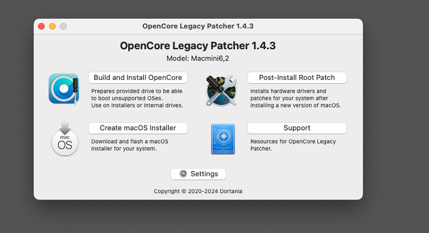
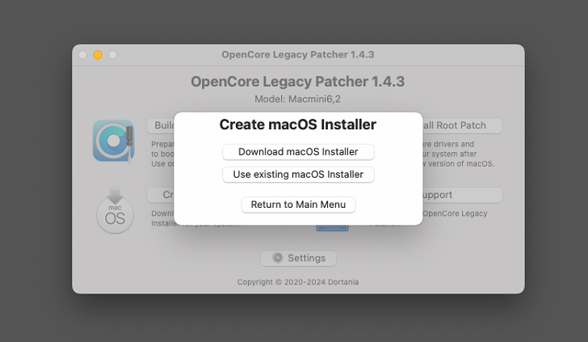
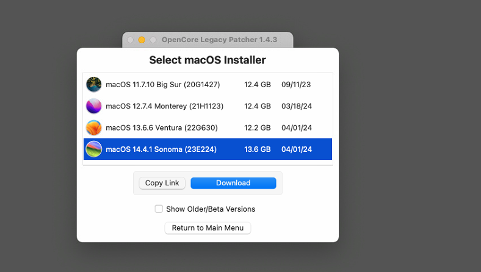
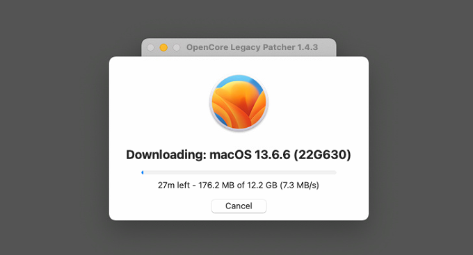
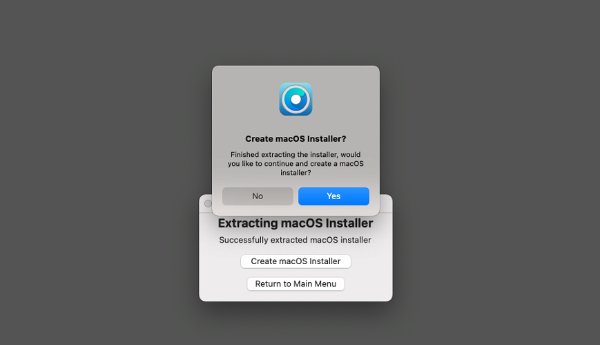
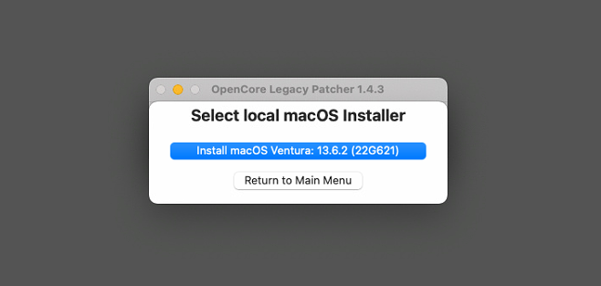

+++
title = 'Mac OS - Image Rebuild'
+++

### Hardware
Device........: Mac Mini (Late 2012) \
Processor..: 2.5Ghz Duel-Core Intel \
Memory.....: 8GB 1600mhz DDR3 (4GB x2) \
Graphics...: Intel HD Graphics 4000 (512mb) \
Local Disk.: Corsair Force GT 120GB SSD

### Quick Links
[OpenCORE OS Installer](https://dortania.github.io/OpenCore-Install-Guide/prerequisites.html) \
[OenCORE LegacyOS Patcher](https://dortania.github.io/OpenCore-Legacy-Patcher) \
[MacOS Download (Help Page)](https://support.apple.com/en-us/102662)

### Operating System Rebuild Notes

Download the latest OpenCore Legacy Patcher from GitHib [Link Here](https://github.com/dortania/OpenCore-Legacy-Patcher/releases).

> **NOTE** \
> Once the zip has downloaded, it will auto extract the app

Launch OpenCore Legacy Patcher

Choose `Create MacOS Installer` and then `Download MacOS Installer`

Choose MacOS Version you want to download

Grab a coffee, this can take some time.

Insert USB stick into Mac

> **NOTE** \
> Ensure that USB is 16Gb+

Choose MacOS Image

Choose USB device

> **NOTE** \
> Coffee Time! This takes 30 minutes +

### Booting OpenCore Legacy Patcher (USB)

[Offical Docs](https://dortania.github.io/OpenCore-Legacy-Patcher/BOOT.html)

In short, Plug in the USB into the Mac, Hold Option\Alt Key. and boot from EFI partition - NOT Install MacOS 

Once the installation has completed, Head to [Post Configuration](https://dortania.github.io/OpenCore-Legacy-Patcher/POST-INSTALL.html)

### Post Configuration - MacOS
After the initial setup has been completed, Run though the Legacy Patcher Post Configuration. 
When the Mac reboots, Hold `ALT` and then choose the `EFI` partition. 
