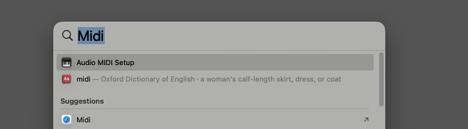

+++
title = 'MacOS - MIDI'
weight = '3'
+++

### Application Setup (Mac OS)

> **NOTE** \
> COMMAND in WIN 

Open Spotlight `COMMAND` + `SPACE` and search for `Audio MIDI Setup`

From Audio Devices `COMMAND` + `2` this open `Midi Studio`

From the top menu `MIDI Studio` > `Open MIDI Network Setup`

